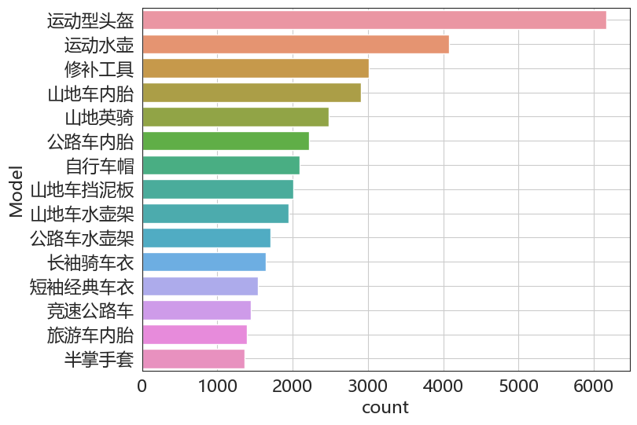

# 基于关联规则实现的智能推荐算法
在最近工作上偶然的发现了接触到关联规则这项技术，了解到这个算法适用于实现智能推荐算法，所以打算对其深入了解一下，觊觎一下CURD仔没曾看见过的算法世界。
作为一个偏向业务的程序员，我们最常接触的到智能推荐的应用场景无疑是商城中的推荐商品，以及咨询中的咨询推荐。

常见的推荐系统分类有：
- 基于应用领域: 电子商务/社交好友推荐等
- 基于设计思想: 基于协同过滤的推荐等
- 基于使用数据: 基于用户标签的推荐等

比如在商品详情页下推荐类似的商品，在新闻详情页下推送类似的新闻。

# 关联规则是什么？
> 关联规则通常指的是关联规则学习（Association Rule Learning），这是数据挖掘和机器学习领域的一个技术，用于发现数据集中项之间的有趣关系。
> 关联规则主要用于在大规模数据集中识别项之间的频繁关联或规律，常用于市场篮子分析、商品推荐等应用场景。最常见的关联规则算法是 Apriori 和 FP-growth。

从上面的解析我们可以得出，我们可以使用关联规则，商品和商品之间的关系。比如在用户的订单中经常会出现牛奶和面包这两件商品，那么这时候就会形成一个关联规则，由此我们可以推断出购买牛奶的用户也极大的 几率会去购买面包。

# 关联规则的三种关系
当我们在计算出商品的关联规则时，我们需要了解到这些规则中存在三种关系。

- 强关联：强关联的商品彼此间会互相存在，比如商品A剃须刀，商品B剃须膏。如果购买了剃须膏就必须购买剃须刀，购买了剃须刀就比徐购买剃须刀。这种关系是双向的，称之为双向关联。单向关联，比如香烟和打火机，购买了香烟的人可能需要购买打火机，但是购买了打火机的人不一定需要购买香烟。
- 弱关联：两个关联程度不高的商品，两种可能存在关联的商品，可以考虑将他们摆放一起，如果后续关联度提高，那么意味着他们会存在强关联关系，目前关联度不高可能是因为陈列原因造成。
- 排斥：指两个商品不会同时出现。

# 商品关联分析三度
## 支持度
支持度 = （同时包含商品A和商品B的订单总数） / 总订单数 * 100% 
支持度主要表示，在所有交易中出现关联商品的概率。即是有多少用户会同时购买关联的商品

## 可信度
可信度 = （同时包含商品A和商品B的订单总数） / 包含商品A的总订单数 * 100%
表示在购买了A商品的订单中有多少包含了商品B 

## 提升度
提升度 = 可信度 / 商品B在总订单中出现的概率 * 100
提升度用于表示商品A对商品B销量提升的影响

可以这样理解：
支持度代表这组关联商品的份额是否够大
置信度(可信度)代表关联度的强弱
而提升度则是看该关联规则是否有利用价值和值得推广，用了(客户购买后推荐)比没用(客户自然而然的购买)要提高多少。

# 基础数据预览
下面我们导入实现算法所需要的数据，以及取出前十五畅销的商品


```python
import pandas as pd

# 基础绘图库
import matplotlib.pyplot as plt
import seaborn as sns

# %matplotlib inline
# 各种细节配置如 文字大小，图例文字等杂项
large = 22
med = 16
small = 12
params = {'axes.titlesize': large,
          'legend.fontsize': med,
          'figure.figsize': (16, 10),
          'axes.labelsize': med,
          'xtick.labelsize': med,
          'ytick.labelsize': med,
          'figure.titlesize': large}
plt.rcParams.update(params)
sns.set_style("whitegrid")
# 使用Seaborn设置风格
sns.set_style("white")
plt.rc('font', **{'family': 'Microsoft YaHei, SimHei'})  # 设置中文字体的支持
# sns.set(font='SimHei')  # 解决Seaborn中文显示问题，但会自动添加背景灰色网格

plt.rcParams['axes.unicode_minus'] = False
# 解决保存图像是负号'-'显示为方块的问题

df = pd.read_csv('bike_data.csv', encoding='gbk')
df.info()
df.head()
```

    <class 'pandas.core.frame.DataFrame'>
    RangeIndex: 52761 entries, 0 to 52760
    Data columns (total 3 columns):
     #   Column       Non-Null Count  Dtype 
    ---  ------       --------------  ----- 
     0   OrderNumber  52761 non-null  object
     1   LineNumber   52761 non-null  int64 
     2   Model        52761 non-null  object
    dtypes: int64(1), object(2)
    memory usage: 1.2+ MB


<div>
<style scoped>
    .dataframe tbody tr th:only-of-type {
        vertical-align: middle;
    }

    .dataframe tbody tr th {
        vertical-align: top;
    }
    
    .dataframe thead th {
        text-align: right;
    }
</style>
<table border="1" class="dataframe">
  <thead>
    <tr style="text-align: right;">
      <th></th>
      <th>OrderNumber</th>
      <th>LineNumber</th>
      <th>Model</th>
    </tr>
  </thead>
  <tbody>
    <tr>
      <th>0</th>
      <td>cumid51178</td>
      <td>1</td>
      <td>山地英骑</td>
    </tr>
    <tr>
      <th>1</th>
      <td>cumid51178</td>
      <td>2</td>
      <td>山地车水壶架</td>
    </tr>
    <tr>
      <th>2</th>
      <td>cumid51178</td>
      <td>3</td>
      <td>运动水壶</td>
    </tr>
    <tr>
      <th>3</th>
      <td>cumid51184</td>
      <td>1</td>
      <td>山地英骑</td>
    </tr>
    <tr>
      <th>4</th>
      <td>cumid51184</td>
      <td>2</td>
      <td>hl山地外胎</td>
    </tr>
  </tbody>
</table>
</div>


```python
# 检查数据是否重复
duplicates = df.duplicated().sum()
print("重复行数: {}, 总行数: {}".format(duplicates, df.shape[0]))
```

    重复行数: 0, 总行数: 52761


```python
# 展示商品
print(f"数据集中共有{df['Model'].nunique()}种商品")
model_names = df['Model'].unique()
print("商品名分别为：")
# 5 个为一行显示
for i in range(0, len(model_names), 5):
    print(model_names[i:i + 5])
```

    数据集中共有37种商品
    商品名分别为：
    ['山地英骑' '山地车水壶架' '运动水壶' 'hl山地外胎' '山地车内胎']
    ['运动型头盔' '普通公路车' '公路车内胎' 'hl公路外胎' '竞速公路车']
    ['公路车水壶架' '长袖骑车衣' '山地车挡泥板' '自行车帽' '山地车400']
    ['ml山地外胎' '修补工具' '山地车500' '公路车550' '短袖经典车衣']
    ['旅游型自行车(大)' '竞速袜' '半掌手套' '公路车350' 'ml公路外胎']
    ['水壶包' '旅游型自行车(小)' '旅游型自行车(中)' '旅游车内胎' 'll公路车外胎']
    ['旅游自行车外胎(通用)' '万能自行车座' '洗车喷剂' '经典背心' 'll山地胎']
    ['故障栓钩' "Women's Mountain Shorts"]


```python
# 最畅销的 15 种商品
# 往 reset_index 中添加 name 参数可快速重命名列名
grouped = df.groupby('Model')['Model'].count().reset_index(name='count')
# 排序后取销量前十五的商品
top_15 = grouped.sort_values(by='count', ascending=False).head(15)
# 绘图展示
plt.figure(figsize=(8, 6))
sns.barplot(data=top_15, x='count', y='Model')
plt.grid(True)
plt.show()

top_15 = top_15['Model'].tolist()
print('初步分析，该自行车店的排名前15的畅销单品为如下：')
for i in range(0, len(top_15), 5):
    print(top_15[i:i + 5])
```


​    

​    


    初步分析，该自行车店的排名前15的畅销单品为如下：
    ['运动型头盔', '运动水壶', '修补工具', '山地车内胎', '山地英骑']
    ['公路车内胎', '自行车帽', '山地车挡泥板', '山地车水壶架', '公路车水壶架']
    ['长袖骑车衣', '短袖经典车衣', '竞速公路车', '旅游车内胎', '半掌手套']


# 使用Apriori算法生成关联规则
1. 有关Apriori算法已经相当成熟，我们只需要做一个调包侠即可。下面引入相关的算法包，并传入数据集。


```python
# 构建所需要的数据集合
df_group = df.groupby("OrderNumber")
dataset = []
for name, group in df_group:
    dataset.append(list(set(group["Model"])))

print(dataset[:5])
```

    [['公路车水壶架', '普通公路车'], ['旅游型自行车(中)', '运动型头盔'], ['山地英骑', '运动水壶', '山地车水壶架'], ['公路车内胎', '万能自行车座', '普通公路车', 'hl公路外胎'], ['长袖骑车衣', '运动型头盔', '公路车水壶架', '运动水壶', '普通公路车']]


2. 我们可以通过如下方式将其转换为正确的格式：TransactionEncoder


```python
import pandas as pd
from mlxtend.preprocessing import TransactionEncoder

te = TransactionEncoder()
te_ary = te.fit(dataset).transform(dataset)
new_df = pd.DataFrame(te_ary, columns=te.columns_)
```

3. 通过Apriori算法生成关联规则，将最小支持度设置为0.01,最小置信度设置为0.1。


```python
from mlxtend.frequent_patterns import apriori, association_rules

# 使用apriori算法找出频繁项集
frequent_itemsets = apriori(df=new_df, min_support=0.01, use_colnames=True, max_len=2)

# 生成关联规则
rules = association_rules(frequent_itemsets, metric='confidence', min_threshold=0.1)

# 显示结果
print("频繁项集：")
print(frequent_itemsets[0:2])

print("\n关联规则：")
print(rules.head(2))
```

    频繁项集：
        support                   itemsets
    0  0.045072  (Women's Mountain Shorts)
    1  0.037826                   (hl公路外胎)
    
    关联规则：
    <class 'pandas.core.frame.DataFrame'>
    RangeIndex: 102 entries, 0 to 101
    Data columns (total 10 columns):
     #   Column              Non-Null Count  Dtype  
    ---  ------              --------------  -----  
     0   antecedents         102 non-null    object 
     1   consequents         102 non-null    object 
     2   antecedent support  102 non-null    float64
     3   consequent support  102 non-null    float64
     4   support             102 non-null    float64
     5   confidence          102 non-null    float64
     6   lift                102 non-null    float64
     7   leverage            102 non-null    float64
     8   conviction          102 non-null    float64
     9   zhangs_metric       102 non-null    float64
    dtypes: float64(8), object(2)
    memory usage: 8.1+ KB
    None


1. **antecedents**：前项，即规则左侧的项集。在这个示例中，`(hl公路外胎)`是前项。

2. **consequents**：后项，即规则右侧的项集。在这个示例中，`(修补工具)`和`(公路车内胎)`是后项。

3. **antecedent support**：前项支持度，表示数据集中包含前项的比例。在这个示例中，`hl公路外胎`的支持度为0.037826。

4. **consequent support**：后项支持度，表示数据集中包含后项的比例。在这个示例中，`修补工具`的支持度为0.141614，`公路车内胎`的支持度为0.104258。

5. **support**：支持度，表示同时包含前项和后项的比例。在这个示例中，同时包含`hl公路外胎`和`修补工具`的比例为0.010209，同时包含`hl公路外胎`和`公路车内胎`的比例为0.025970。

6. **confidence**：置信度，表示在包含前项的情况下同时包含后项的概率。在这个示例中，置信度为0.269900和0.686567。

7. **lift**：提升度，表示规则的关联程度。提升度大于1表示正相关，提升度等于1表示没有关联，提升度小于1表示负相关。在这个示例中，`修补工具`的提升度为1.905892，`公路车内胎`的提升度为6.585282，这些都是正相关。

8. **leverage**：杠杆值，表示前项和后项出现的频率超过它们如果是独立的预期频率的程度。在这个示例中，`修补工具`的杠杆值为0.004853，`公路车内胎`的杠杆值为0.022027。

9. **conviction**：确信度，表示规则后项出现的条件下，前项不出现的相对风险。在这个示例中，`修补工具`的确信度为1.175711，`公路车内胎`的确信度为2.857844。

10. **zhangs_metric**：Zhang的度量，是一种基于置信度和支持度的度量。在这个示例中，`修补工具`的Zhang's度量为0.493997，`公路车内胎`的Zhang's度量为0.881490。

# 需要重点关注的参数
+ support: 支持度，山地车内胎 和 ll山地胎 同时出现在一张购物小票中的概率
+ confidence: 置信度，购买了 山地车内胎 的前提下，同时购买 ll山地胎 的概率
+ lift：向购买了 山地车内胎 的客户推荐 ll山地胎 的话，这个客户购买 ll山地胎 的概率是这个客户自然而然购买 ll山地胎 的 400% 左右，即高了 300% 多，通俗理解：消费者平时较少单独购买桌角防撞海绵，可能偶尔想到的时候或自己小孩碰到的时候才会想起购买，如果我们在桌子(书桌饭桌)的成功下单页面添加桌角防撞海绵的推荐，则很大程度上可以提高防撞海绵的销量。这也符合我们在探索性数据分析中发现的前 15 名畅销商品后并希望通过畅销商品带动“相对非畅销商品”的宗旨。  

# 筛选出互补和互斥的数据


```python
# 查找出lift > 1 和 1 < 的数据

# 找出 lift > 1 的数据
lift_1 = rules[rules['lift'] > 1].sort_values(by='lift', ascending=False).head(5)
# 找出 1 < lift 的数据
lift_2 = rules[rules['lift'] < 1].sort_values(by='lift', ascending=False).head(5)

# 打印出 lift > 1 的数据
print("互补规则：")
print(lift_1)

print("互斥规则：")
# 打印出 1 < lift 的数据
print(lift_2)
```

    互补规则：
          antecedents    consequents  antecedent support  consequent support  \
    82        (旅游车内胎)  (旅游自行车外胎(通用))            0.065726            0.041449   
    83  (旅游自行车外胎(通用))        (旅游车内胎)            0.041449            0.065726   
    2         (公路车内胎)       (hl公路外胎)            0.104258            0.037826   
    1        (hl公路外胎)        (公路车内胎)            0.037826            0.104258   
    21       (ml公路外胎)        (公路车内胎)            0.041873            0.104258   
    
         support  confidence       lift  leverage  conviction  zhangs_metric  
    82  0.035662    0.542591  13.090553  0.032938    2.095611       0.988584  
    83  0.035662    0.860386  13.090553  0.032938    6.691835       0.963547  
    2   0.025970    0.249097   6.585282  0.022027    1.281356       0.946864  
    1   0.025970    0.686567   6.585282  0.022027    2.857844       0.881490  
    21  0.027288    0.651685   6.250710  0.022922    2.571647       0.876729  
    互斥规则：
       antecedents consequents  antecedent support  consequent support   support  \
    61      (山地英骑)     (运动型头盔)            0.116537            0.290332  0.033404   
    62     (运动型头盔)      (山地英骑)            0.290332            0.116537  0.033404   
    56     (山地车内胎)      (山地英骑)            0.136815            0.116537  0.015573   
    55      (山地英骑)     (山地车内胎)            0.116537            0.136815  0.015573   
    90     (竞速公路车)     (运动型头盔)            0.067890            0.290332  0.019054   
    
        confidence      lift  leverage  conviction  zhangs_metric  
    61    0.286637  0.987274 -0.000431    0.994821      -0.014380  
    62    0.115054  0.987274 -0.000431    0.998324      -0.017839  
    56    0.113824  0.976717 -0.000371    0.996938      -0.026874  
    55    0.133629  0.976717 -0.000371    0.996323      -0.026274  
    90    0.280665  0.966706 -0.000656    0.986562      -0.035633  


# 根据需求推荐数据
需要结合业务需求

- 获得最大营销响应度？-- 看置信度，越高越好
- 销售最大化？-- 看提升度，越高越好
- 用户未产生消费，我们向其推荐商品？

## 以获得最高的营销相应率为目标
如果一个新客户刚刚下单了 山地车英骑 这个产品，

如果希望获得最高的营销响应率，那在他付费成功页面上最应该推荐什么产品？


```python
# 使用的是左手规则：lhs(left hand rule)，lhs 表示的是购买的产品
## 使用 frozenset 来对字典的键进行选择
purchase_good = rules[rules['antecedents'] == frozenset({'山地英骑'})]
purchase_good.sample(3)
```


<div>
<style scoped>
    .dataframe tbody tr th:only-of-type {
        vertical-align: middle;
    }

    .dataframe tbody tr th {
        vertical-align: top;
    }
    
    .dataframe thead th {
        text-align: right;
    }
</style>
<table border="1" class="dataframe">
  <thead>
    <tr style="text-align: right;">
      <th></th>
      <th>antecedents</th>
      <th>consequents</th>
      <th>antecedent support</th>
      <th>consequent support</th>
      <th>support</th>
      <th>confidence</th>
      <th>lift</th>
      <th>leverage</th>
      <th>conviction</th>
      <th>zhangs_metric</th>
    </tr>
  </thead>
  <tbody>
    <tr>
      <th>55</th>
      <td>(山地英骑)</td>
      <td>(山地车内胎)</td>
      <td>0.116537</td>
      <td>0.136815</td>
      <td>0.015573</td>
      <td>0.133629</td>
      <td>0.976717</td>
      <td>-0.000371</td>
      <td>0.996323</td>
      <td>-0.026274</td>
    </tr>
    <tr>
      <th>63</th>
      <td>(山地英骑)</td>
      <td>(运动水壶)</td>
      <td>0.116537</td>
      <td>0.191767</td>
      <td>0.027711</td>
      <td>0.237788</td>
      <td>1.239984</td>
      <td>0.005363</td>
      <td>1.060378</td>
      <td>0.219068</td>
    </tr>
    <tr>
      <th>30</th>
      <td>(山地英骑)</td>
      <td>(修补工具)</td>
      <td>0.116537</td>
      <td>0.141614</td>
      <td>0.015385</td>
      <td>0.132015</td>
      <td>0.932216</td>
      <td>-0.001119</td>
      <td>0.988941</td>
      <td>-0.076046</td>
    </tr>
  </tbody>
</table>
</div>


```python
# 根据置信度排序
purchase_good.sort_values(by='confidence', ascending=False).head(5)
```


<div>
<style scoped>
    .dataframe tbody tr th:only-of-type {
        vertical-align: middle;
    }

    .dataframe tbody tr th {
        vertical-align: top;
    }
    
    .dataframe thead th {
        text-align: right;
    }
</style>
<table border="1" class="dataframe">
  <thead>
    <tr style="text-align: right;">
      <th></th>
      <th>antecedents</th>
      <th>consequents</th>
      <th>antecedent support</th>
      <th>consequent support</th>
      <th>support</th>
      <th>confidence</th>
      <th>lift</th>
      <th>leverage</th>
      <th>conviction</th>
      <th>zhangs_metric</th>
    </tr>
  </thead>
  <tbody>
    <tr>
      <th>57</th>
      <td>(山地英骑)</td>
      <td>(山地车挡泥板)</td>
      <td>0.116537</td>
      <td>0.094754</td>
      <td>0.034345</td>
      <td>0.294711</td>
      <td>3.110273</td>
      <td>0.023302</td>
      <td>1.283511</td>
      <td>0.767984</td>
    </tr>
    <tr>
      <th>59</th>
      <td>(山地英骑)</td>
      <td>(山地车水壶架)</td>
      <td>0.116537</td>
      <td>0.091320</td>
      <td>0.034110</td>
      <td>0.292693</td>
      <td>3.205144</td>
      <td>0.023467</td>
      <td>1.284704</td>
      <td>0.778756</td>
    </tr>
    <tr>
      <th>61</th>
      <td>(山地英骑)</td>
      <td>(运动型头盔)</td>
      <td>0.116537</td>
      <td>0.290332</td>
      <td>0.033404</td>
      <td>0.286637</td>
      <td>0.987274</td>
      <td>-0.000431</td>
      <td>0.994821</td>
      <td>-0.014380</td>
    </tr>
    <tr>
      <th>63</th>
      <td>(山地英骑)</td>
      <td>(运动水壶)</td>
      <td>0.116537</td>
      <td>0.191767</td>
      <td>0.027711</td>
      <td>0.237788</td>
      <td>1.239984</td>
      <td>0.005363</td>
      <td>1.060378</td>
      <td>0.219068</td>
    </tr>
    <tr>
      <th>5</th>
      <td>(山地英骑)</td>
      <td>(hl山地外胎)</td>
      <td>0.116537</td>
      <td>0.062621</td>
      <td>0.023524</td>
      <td>0.201857</td>
      <td>3.223495</td>
      <td>0.016226</td>
      <td>1.174451</td>
      <td>0.780766</td>
    </tr>
  </tbody>
</table>
</div>


# 以最大化总体销售额为目标
如果一个新客户刚下单了 山地英骑 这个产品，

如果希望最大化提升总体的销售额，那么在他付费成功的页面上应该推荐什么产品？

目标：最大化销售额


```python
# 使用提升度来进行推荐
purchase_good.sort_values(by='lift', ascending=False).head(5)
```


<div>
<style scoped>
    .dataframe tbody tr th:only-of-type {
        vertical-align: middle;
    }

    .dataframe tbody tr th {
        vertical-align: top;
    }
    
    .dataframe thead th {
        text-align: right;
    }
</style>
<table border="1" class="dataframe">
  <thead>
    <tr style="text-align: right;">
      <th></th>
      <th>antecedents</th>
      <th>consequents</th>
      <th>antecedent support</th>
      <th>consequent support</th>
      <th>support</th>
      <th>confidence</th>
      <th>lift</th>
      <th>leverage</th>
      <th>conviction</th>
      <th>zhangs_metric</th>
    </tr>
  </thead>
  <tbody>
    <tr>
      <th>5</th>
      <td>(山地英骑)</td>
      <td>(hl山地外胎)</td>
      <td>0.116537</td>
      <td>0.062621</td>
      <td>0.023524</td>
      <td>0.201857</td>
      <td>3.223495</td>
      <td>0.016226</td>
      <td>1.174451</td>
      <td>0.780766</td>
    </tr>
    <tr>
      <th>59</th>
      <td>(山地英骑)</td>
      <td>(山地车水壶架)</td>
      <td>0.116537</td>
      <td>0.091320</td>
      <td>0.034110</td>
      <td>0.292693</td>
      <td>3.205144</td>
      <td>0.023467</td>
      <td>1.284704</td>
      <td>0.778756</td>
    </tr>
    <tr>
      <th>57</th>
      <td>(山地英骑)</td>
      <td>(山地车挡泥板)</td>
      <td>0.116537</td>
      <td>0.094754</td>
      <td>0.034345</td>
      <td>0.294711</td>
      <td>3.110273</td>
      <td>0.023302</td>
      <td>1.283511</td>
      <td>0.767984</td>
    </tr>
    <tr>
      <th>63</th>
      <td>(山地英骑)</td>
      <td>(运动水壶)</td>
      <td>0.116537</td>
      <td>0.191767</td>
      <td>0.027711</td>
      <td>0.237788</td>
      <td>1.239984</td>
      <td>0.005363</td>
      <td>1.060378</td>
      <td>0.219068</td>
    </tr>
    <tr>
      <th>61</th>
      <td>(山地英骑)</td>
      <td>(运动型头盔)</td>
      <td>0.116537</td>
      <td>0.290332</td>
      <td>0.033404</td>
      <td>0.286637</td>
      <td>0.987274</td>
      <td>-0.000431</td>
      <td>0.994821</td>
      <td>-0.014380</td>
    </tr>
  </tbody>
</table>
</div>


再次重申提升度通俗含义

提升度是相对于自然而然购买而言，A对B的提升度为4.0的理解如下

向购买了A的用户推荐B，则该用户购买B的概率是该用户单独  
（即自然而然的购买）购买B的概率的 400%  

向购买了A的用户推荐B，则该用户购买B的概率比该用户单独  
（即自然而然的购买）购买B的概率高300%

# 用户并未产生消费，我们为其推荐某样商品


```python
# 如果希望推荐山地英骑自行车，应该如何制定营销策略？
## 这里应该选出右手规则，因为直接就是推荐的产品，
##没有产生消费，消费了的即买了的才使用左手规则
purchase_good = rules[rules['consequents'] == frozenset({'山地英骑'})].sort_values('lift')

# 根据置信度或提升度排序都可以，因为直接根据右手规则选出来的数据框中，
## confidence 和 lift 成正比例关系，你高我就高
purchase_good
# 所以山地英骑跟山地车水壶架，山地车挡泥板，hl山地外胎一起推荐比较好
```


<div>
<style scoped>
    .dataframe tbody tr th:only-of-type {
        vertical-align: middle;
    }

    .dataframe tbody tr th {
        vertical-align: top;
    }
    
    .dataframe thead th {
        text-align: right;
    }
</style>
<table border="1" class="dataframe">
  <thead>
    <tr style="text-align: right;">
      <th></th>
      <th>antecedents</th>
      <th>consequents</th>
      <th>antecedent support</th>
      <th>consequent support</th>
      <th>support</th>
      <th>confidence</th>
      <th>lift</th>
      <th>leverage</th>
      <th>conviction</th>
      <th>zhangs_metric</th>
    </tr>
  </thead>
  <tbody>
    <tr>
      <th>31</th>
      <td>(修补工具)</td>
      <td>(山地英骑)</td>
      <td>0.141614</td>
      <td>0.116537</td>
      <td>0.015385</td>
      <td>0.108638</td>
      <td>0.932216</td>
      <td>-0.001119</td>
      <td>0.991138</td>
      <td>-0.078094</td>
    </tr>
    <tr>
      <th>56</th>
      <td>(山地车内胎)</td>
      <td>(山地英骑)</td>
      <td>0.136815</td>
      <td>0.116537</td>
      <td>0.015573</td>
      <td>0.113824</td>
      <td>0.976717</td>
      <td>-0.000371</td>
      <td>0.996938</td>
      <td>-0.026874</td>
    </tr>
    <tr>
      <th>62</th>
      <td>(运动型头盔)</td>
      <td>(山地英骑)</td>
      <td>0.290332</td>
      <td>0.116537</td>
      <td>0.033404</td>
      <td>0.115054</td>
      <td>0.987274</td>
      <td>-0.000431</td>
      <td>0.998324</td>
      <td>-0.017839</td>
    </tr>
    <tr>
      <th>64</th>
      <td>(运动水壶)</td>
      <td>(山地英骑)</td>
      <td>0.191767</td>
      <td>0.116537</td>
      <td>0.027711</td>
      <td>0.144504</td>
      <td>1.239984</td>
      <td>0.005363</td>
      <td>1.032691</td>
      <td>0.239458</td>
    </tr>
    <tr>
      <th>58</th>
      <td>(山地车挡泥板)</td>
      <td>(山地英骑)</td>
      <td>0.094754</td>
      <td>0.116537</td>
      <td>0.034345</td>
      <td>0.362463</td>
      <td>3.110273</td>
      <td>0.023302</td>
      <td>1.385743</td>
      <td>0.749503</td>
    </tr>
    <tr>
      <th>60</th>
      <td>(山地车水壶架)</td>
      <td>(山地英骑)</td>
      <td>0.091320</td>
      <td>0.116537</td>
      <td>0.034110</td>
      <td>0.373519</td>
      <td>3.205144</td>
      <td>0.023467</td>
      <td>1.410198</td>
      <td>0.757144</td>
    </tr>
    <tr>
      <th>6</th>
      <td>(hl山地外胎)</td>
      <td>(山地英骑)</td>
      <td>0.062621</td>
      <td>0.116537</td>
      <td>0.023524</td>
      <td>0.375657</td>
      <td>3.223495</td>
      <td>0.016226</td>
      <td>1.415029</td>
      <td>0.735858</td>
    </tr>
  </tbody>
</table>
</div>

